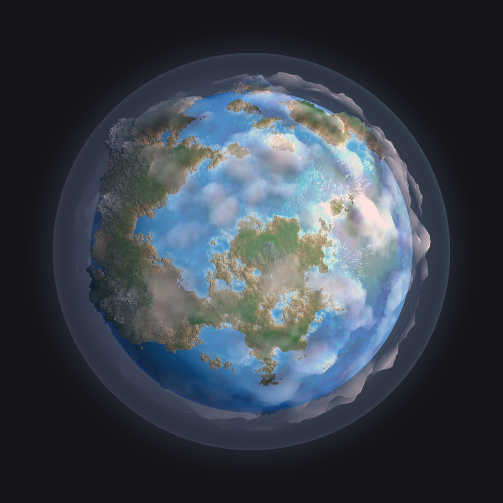

# CIS 566 Project 1: Noisy Planets

* Name: Linshen Xiao
* PennKey: Linshen
* Tested on: Windows 10, Intel(R) Core(TM) i7-6700HQ CPU @ 2.60GHz, 16.0GB, NVIDIA GeForce GTX 970M (Personal computer)

## Demo

- [https://githublsx.github.io/homework-1-noisy-planets-githublsx/](https://githublsx.github.io/homework-1-noisy-planets-githublsx/);
- Set tesselations higher for better result(lower framerate!);
- Set change to 1 to animate the terrain;

## Objective
- Continue practicing WebGL and Typescript
- Experiment with noise functions to procedurally generate the surface of a planet
- Review surface reflection models

## Assignment Details

### Planet

- Fractal Brownian Motion is used to  create terrian.
- There are 7 levels: Deepest water, deeper water, water, shore, dirt, rock, snow;
- Fractal Brownian Motion is used to determine if the plants will cover the terrian, plants will not cover water and snow;
- Blinn Phong is used to simulate light reflection on ocean and ice/snow;
- Normal is calculated with Gradient Approximation;

### Cloud

- Fractal Brownian Motion is used to determine the alpha value;
- Fractal Brownian Motion is used to determine if the terrian and ocean is coverd by cloud to create shadow;

### Water

- Water will be transparent to show the underwater terrian;
- Blinn Phong is used to simulate light reflection on ocean;

### Atomsphere

- Another transparent sphere is created to minic the glowing effect;
- Terrain-atmosphere Color Interpolation is determined by normal and eye direction;

## Useful Links
- [Noise - value - 3D](https://www.shadertoy.com/view/4sfGzS)
- [Tiny Planet: Earth](https://www.shadertoy.com/view/lt3XDM)
- [Fractal Brownian Motion](https://thebookofshaders.com/13/)
- [Implicit Procedural Planet Generation](https://static1.squarespace.com/static/58a1bc3c3e00be6bfe6c228c/t/58a4d25146c3c4233fb15cc2/1487196929690/ImplicitProceduralPlanetGeneration-Report.pdf)
- [Curl Noise](https://petewerner.blogspot.com/2015/02/intro-to-curl-noise.html)
- [GPU Gems Chapter on Perlin Noise](http://developer.download.nvidia.com/books/HTML/gpugems/gpugems_ch05.html)
- [Worley Noise Implementations](https://thebookofshaders.com/12/)